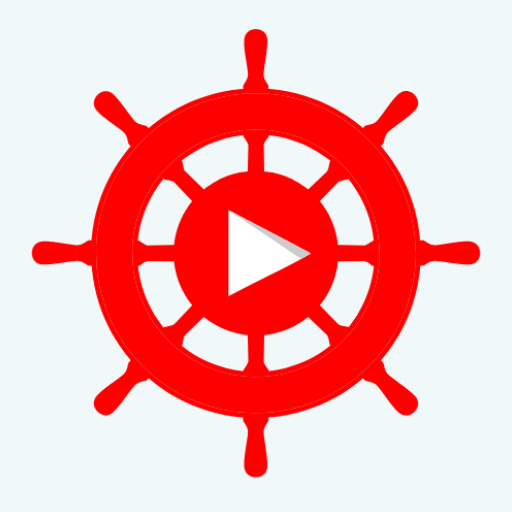

# NavTube - YouTube Discovery App -Beta

NavTube is the ultimate YouTube discovery app. Explore new and interesting videos, save your favorites, and share them with friends.

## Overview

NavTube makes it easy to discover new videos and never run out of things to watch. You can search for specific topics or channels, or use the app's explore feature to find new and interesting videos. Save the videos you like, and organize them using labels and categories.

NavTube also makes it easy to share your favorites with friends. Simply select the videos you want to share, and send them to friends via social media, email, or messaging apps. You can also create playlists of your favorite videos, and share them with others.

## About

- Developed NavTube, a beta Android app for discovering and organizing YouTube content.
- Conducted user research and ideation sessions to identify user pain points and possible solutions.
- Created both low-fi and hi-fi prototypes to test app features and UI/UX design ([Figma Prototype](https://www.figma.com/file/k0mxadhpuaysmno1YigKLe/NavTube?type=design&node-id=45%3A203&mode=design&t=3Sdutk8Gv1ENKT8E-1)).

## Features

- **Discover New Videos**: Use the app to explore new and interesting videos on YouTube.
- **Save Favorites**: Save the videos you like and organize them using labels and categories.
- **Share with Friends**: Easily share your favorite videos with friends via social media, email, or messaging apps.
- **Create Playlists**: Organize your favorite videos into playlists and share them with others.

## Technologies Used

- Google Material Guidelines
- Jetpack Library
- Coroutine
- MVVM Architecture
- Glide library
- Facebook Rebound animation library
- Navigation component
- Room Database library
- Fuel library for networking

## Getting Started

To get started with NavTube, follow these steps:

1. Clone the repository.
2. Open the project in Android Studio.
3. Build and run the app on your Android device or emulator.

